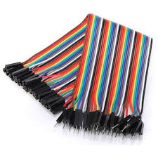

# Tutorial brewpiless en español
Tutorial para ensamblar un controlador brewpiless

## Tabla de contenidos

- [Descripcion](#descripcion)

- [Hardware](#hardware)
- [Ensamblaje](#ensamblaje)
- [Instalacion](#instalacion)
- [Configuracion](#configuracion)
- [Errores frecuentes](#errores)

## Descripcion
[Brewpiless](https://github.com/vitotai) es un port de brewpi desarrollado por [vitotai](https://github.com/vitotai). Utiliza un esp8266 para reemplazar a una Raspberry pi y Arduino.

> Ejecutando BrewPi sin Pi, por lo tanto, BrewPi-Less.

## Hardware

- 1 esp8266 nodemcu

- 1 display Lcd 2004 Backlight Azul 20x4 + Serie I2c Arduino (es importante comprar el que trae adaptador Serie l2c). El display es opcional, pero es cómodo.

- 2 sensores digitales temperatura Ds18b20 Cable Sumergible 2 Metros ( comprar el de 2 metros, el de 1 metro queda muy corto)

- 1 Modulo Relay Rele De 2 Canales 5v 10a Arduino Pic Avr

- 1 resistencia de 4,7k oms (se suele conseguir en cualquier casa de electronica)
- 1 bornera doble de al menos 5 bocas (se suele conseguir en cualquier casa de electronica)

- 15 cables dupont hembra/hembra. 

- 5 cables dupont macho/macho(5).

- 1 cargador de celular (cualquiera que sobre en casa)
- 1 toma doble (se consigue en ferreterías)

- 1 caja para el proyecto ( yo use una caja ciega)

## Instalacion

## Configuracion

## Errores frequentes
