# Brewpiless en español
Tutorial para ensamblar un controlador brewpiless

## Tabla de contenidos

- [Descripcion](#descripcion)

- [Hardware](#hardware)
- [Ensamblaje](#ensamblaje)
- [Instalacion](#instalacion)
- [Configuracion](#configuracion)
- [Errores frecuentes](#errores)

## Descripcion
[Brewpiless](https://github.com/vitotai) es un port de brewpi desarrollado por [vitotai](https://github.com/vitotai). Utiliza un esp8266 para reemplazar a una Raspberry pi y Arduino.

> Ejecutando BrewPi sin Pi, por lo tanto, BrewPi-Less.
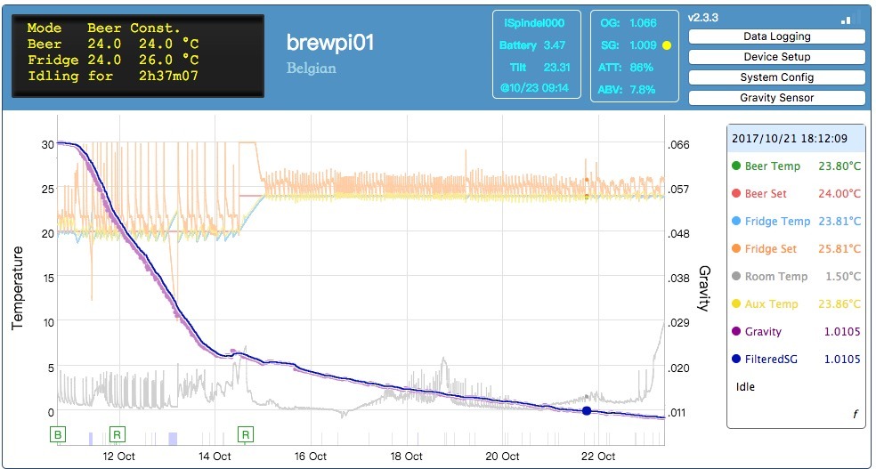

## Hardware

- 1 esp8266 nodemcu
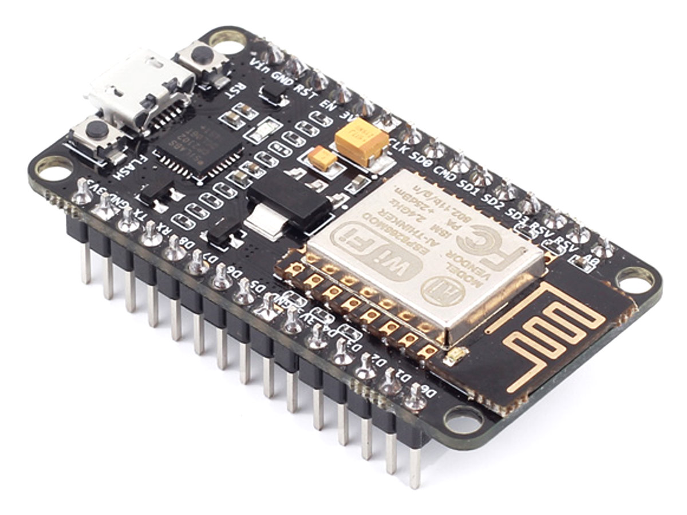

- 1 display Lcd 2004 Backlight Azul 20x4 + Serie I2c Arduino (es importante comprar el que trae adaptador Serie l2c). El display es opcional, pero es cómodo.
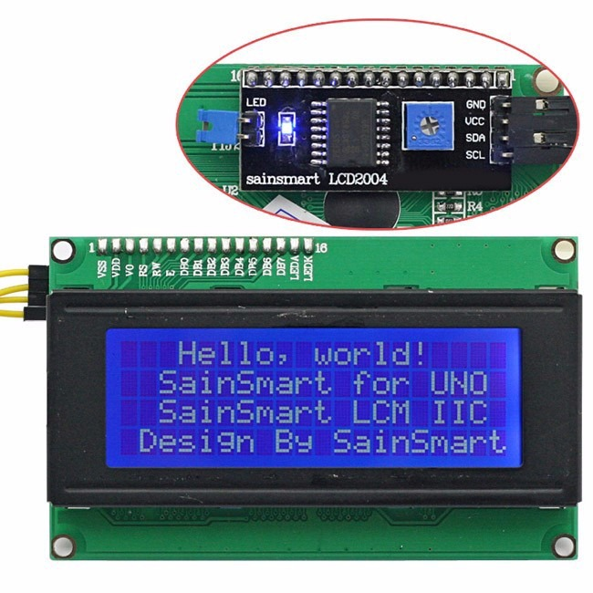
- 2 sensores digitales temperatura Ds18b20 Cable Sumergible 2 Metros ( comprar el de 2 metros, el de 1 metro queda muy corto)
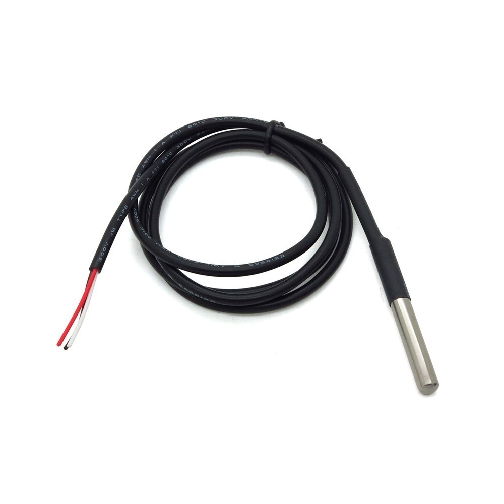
- 1 Modulo Relay Rele De 2 Canales 5v 10a Arduino Pic Avr
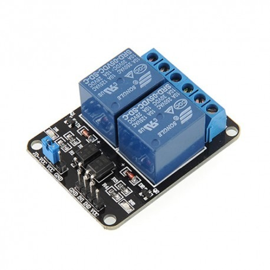
- 1 bornera doble de al menos 5 bocas (se suele conseguir en cualquier casa de electronica)
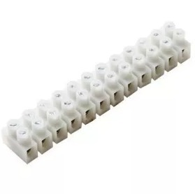
- 20 cables dupont hembra-hembra. 
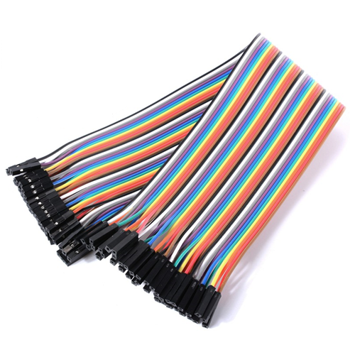
- 1 toma doble (se consigue en ferreterías)
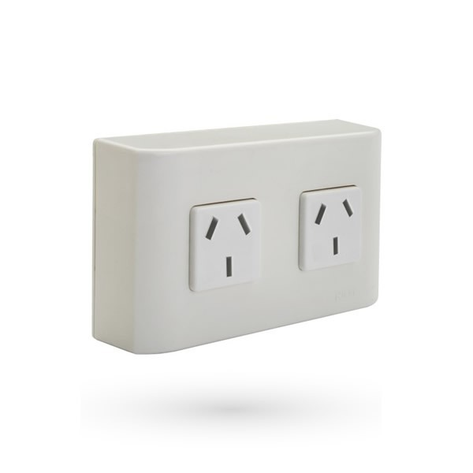

- 1 resistencia de 4,7k oms (se suele conseguir en cualquier casa de electronica)
- 1 caja para el proyecto ( yo use una caja ciega)
- 1 cargador de celular con cable micro usb (cualquiera que sobre en casa)

## Ensamblaje
El ensamblaje es mas sencillo de lo que parece, solo hay que usar los cables hembra-hembra para conectar cada dispositivo al esp8266.
Aca hay diagrama de las conexiones, debajo del mismo dejo algunas notas.  
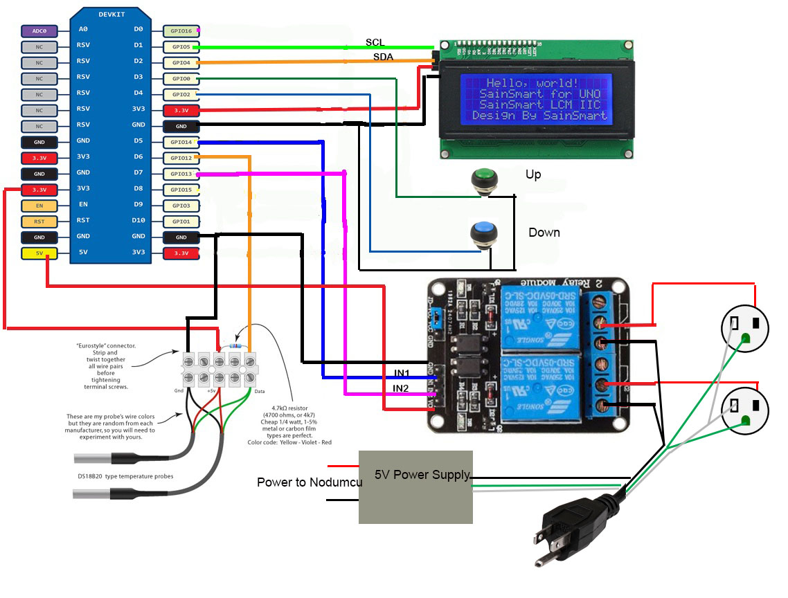

El 5v power supply seria nuestro cargador de celular, este se conecta directo al nodemcu.
Entre el cable de data y el de 5v de los sensores Ds18b20 tiene que ir la resistencia.
La forma mas facil de cablear el esp8266 a bornera es agarrar un cable dupont, sacarle la punta plastica y pelar el cable.  
Lo sensores Ds18b20 pueden venir con 3 configuraciones de colores en los cables:

El tipo 1 donde:

- Cable rojo: VDD
- Cable negro: GND
- Cable amarillo: DQ

  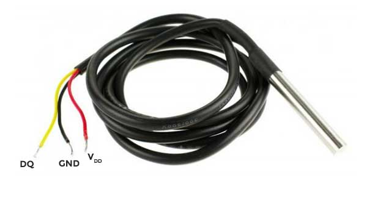
  
  El tipo 2 donde:

- Cable rojo: VDD
- Cable verde: GND
- Cable amarillo: DQ

  
  
  El tipo 3 donde:

- Cable rojo: VDD
- Cable verde: DQ
- Cable amarillo: GND

  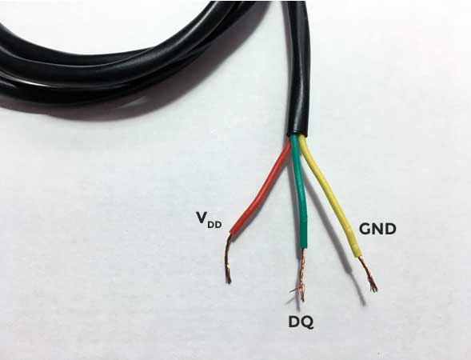
  
## Instalacion

## Configuracion

## Errores frequentes
